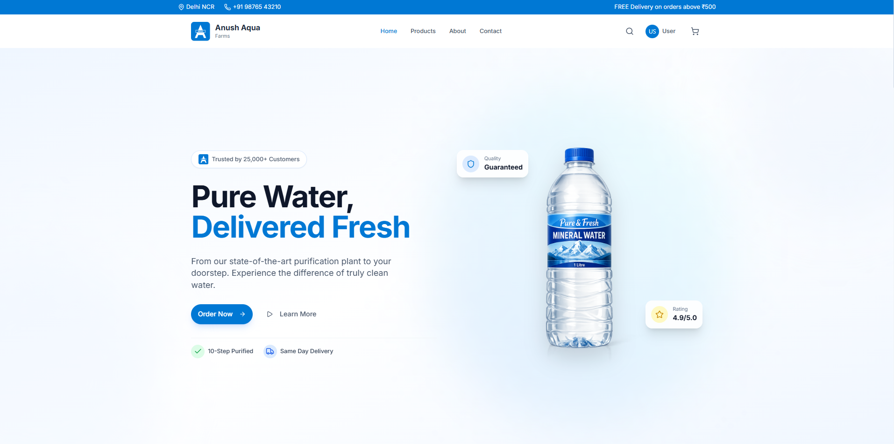
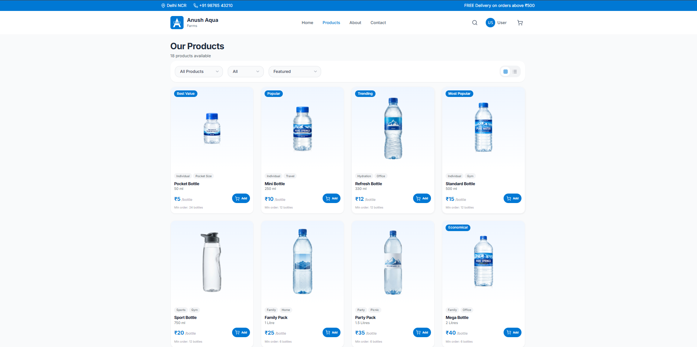
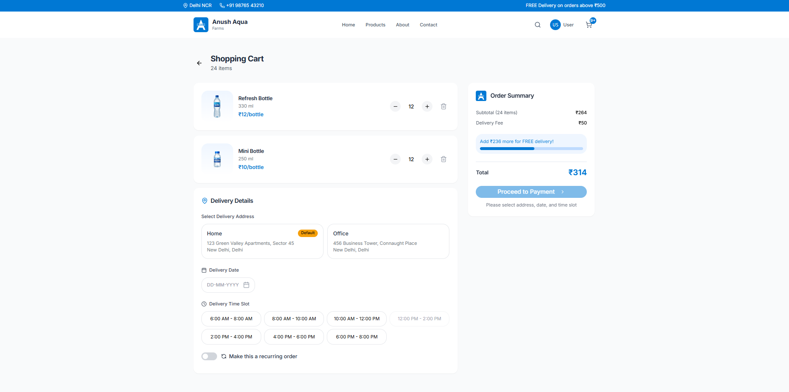
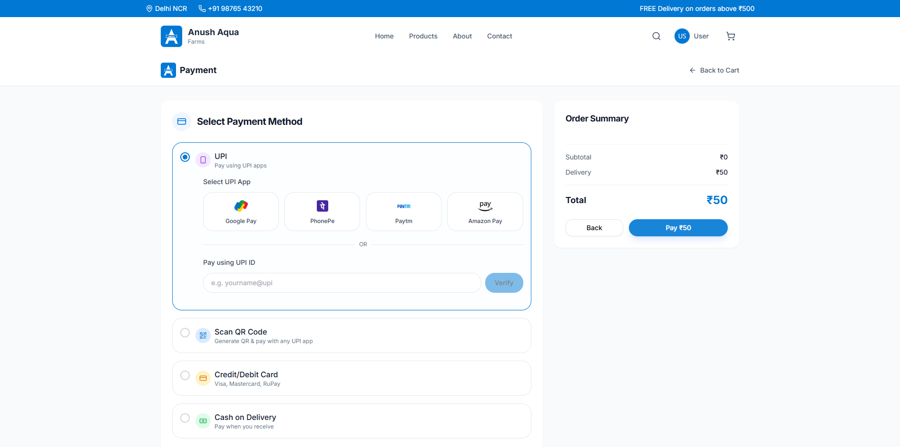
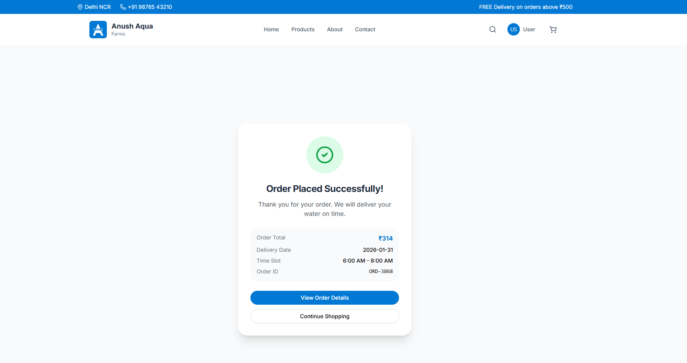

# Anush Aqua Farms - Premium Water Delivery Service



## Overview

Anush Aqua Farms is a modern, full-stack web application designed for a premium water delivery service. Built with React, Vite, and Tailwind CSS, it offers a seamless and aesthetically pleasing user experience for browsing products, managing subscriptions, and placing orders.

The application emphasizes trust, purity, and reliability, featuring a robust set of features including real-time cart management, smart checkout with delivery scheduling, and a comprehensive user account dashboard.

## ✨ Key Features

### 🛍️ Shopping Experience
- **Interactive Product Catalog**: Browse a variety of water products (20L cans, dispensers, premium bottles) with clear pricing and details.
- **Smart Cart**: Real-time cart updates with a progress bar for free delivery thresholds.
- **Recurring Orders**: Option to set up daily, weekly, or monthly delivery schedules directly from the cart.

### 💳 Secure Checkout & Payment
- **Flexible Payment Methods**: Support for UPI (Google Pay, PhonePe, Paytm), Credit/Debit Cards, Cash on Delivery (COD), and QR Code scanning.
- **Advanced Validation**: Real-time validation for UPI IDs and payment inputs to ensure smooth transactions.
- **QR Code Payment**: Integrated modal experience for scanning QR codes with simulated payment processing status.
- **Delivery Scheduling**: Custom date and time slot picker to ensure you get water exactly when you need it.

### 👤 User Account Management
- **Profile Management**: Update personal details (Name, Phone, Email) with edit/save modes.
- **Order History**: Track past orders with status badges (delivered, cancelled, in-transit).
- **Address Book**: Manage multiple delivery addresses with "Set as Default" capabilities.
- **Subscriptions**: View and manage active recurring subscriptions.
- **Notification Preferences**: Toggle email and SMS alerts for orders and offers.

### 🎨 UI/UX Design
- **Modern Aesthetics**: Clean, whitespace-driven design with a calming blue and teal color palette (`#0078D4`, `#00BFA5`).
- **Responsive Layout**: Fully optimized for mobile, tablet, and desktop views.
- **Micro-interactions**: Smooth transitions, hover effects, and loading states for a polished feel.
- **Impact Section**: visually engaging statistics highlighting the brand's reach and eco-friendly initiatives.

---

## 📸 Application Screenshots

### Home Page
*First impressions matter. The landing page features a hero section, impact statistics, and featured products.*


### Product Catalog
*A clean grid layout displaying all available hydration options.*


### Smart Cart
*Manage items, set recurring schedules, and pick delivery slots.*


### Payment Gateway
*Secure and validated checkout with multiple payment options.*


### User Dashboard
*Your personal command center for orders and preferences.*


### Order Success
*Confirmation screen with order summary and tracking details.*


---

## 🛠️ Technology Stack

- **Frontend Framework**: [React](https://reactjs.org/) (v18)
- **Build Tool**: [Vite](https://vitejs.dev/)
- **Styling**: [Tailwind CSS](https://tailwindcss.com/)
- **Icons**: [Lucide React](https://lucide.dev/)
- **Animations**: [GSAP](https://greensock.com/gsap/) (GreenSock Animation Platform)
- **Routing**: [React Router](https://reactrouter.com/)
- **State Management**: React Context API (`CartContext`)

## � Prerequisites

Before you begin, ensure you have the following installed on your local machine:

- **Node.js** (v18 or higher)
- **MySQL** (Server running locally or remotely)
- **Git**

---

## 🚀 Installation & Setup

Follow these steps to set up the project locally with full database connectivity.

### 1. Clone the Repository

```bash
git clone https://github.com/RajAnand132/aqua-farms
cd aqua-farms-main
```

### 2. Database Configuration

Ensure your MySQL server is running. You do not need to manually create the database; the backend will automatically create a database named `aquafarms` (or whatever you configure) if it doesn't exist.

### 3. Backend Setup

The backend handles the API and database connections.

1.  **Navigate to the backend directory:**
    ```bash
    cd backend
    ```

2.  **Install dependencies:**
    ```bash
    npm install
    ```

3.  **Configure Environment Variables:**
    Create a `.env` file in the `backend` directory with the following content. Update the values to match your MySQL configuration:

    ```env
    PORT=5000
    DB_HOST=localhost
    DB_USER=root           # Your MySQL username
    DB_PASSWORD=your_password # Your MySQL password
    DB_NAME=aquafarms      # Database name
    JWT_SECRET=your_jwt_secret_key_change_this
    ```

4.  **Start the Backend Server:**
    ```bash
    npm run dev
    ```
    *You should see "Database connected successfully" and "Server is running on port 5000" in the terminal.*

### 4. Frontend Setup

1.  **Open a new terminal and navigate to the frontend directory:**
    ```bash
    cd frontend
    ```

2.  **Install dependencies:**
    ```bash
    npm install
    ```

3.  **Start the Frontend Application:**
    ```bash
    npm run dev
    ```

4.  **Access the Application:**
    Open your browser and navigate to the URL shown in the terminal (usually `http://localhost:5173`).

## 📂 Project Structure

```
frontend/
├── src/
│   ├── components/     # Reusable UI components (Buttons, Modals, etc.)
│   ├── contexts/       # Global state (Cart, Auth)
│   ├── data/           # Mock data for products and users
│   ├── pages/          # Main route pages (Home, Cart, Payment, etc.)
│   ├── types/          # TypeScript interfaces
│   ├── App.tsx         # Main application entry
│   └── main.tsx        # DOM renderer
└── package.json
```

---

## 🤝 Contributing

Contributions are welcome! Please feel free to submit a Pull Request.

1. Fork the project
2. Create your Feature Branch (`git checkout -b feature/AmazingFeature`)
3. Commit your Changes (`git commit -m 'Add some AmazingFeature'`)
4. Push to the Branch (`git push origin feature/AmazingFeature`)
5. Open a Pull Request

---

© 2026 SathwikReddyB. All rights reserved.
